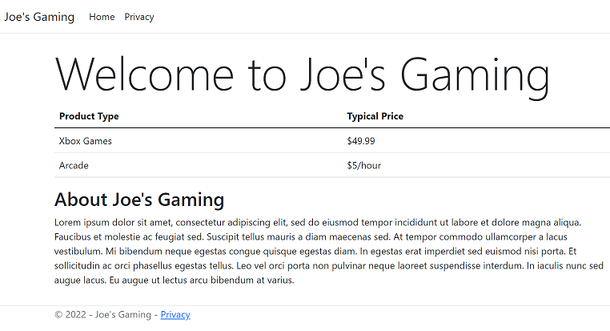

[](https://github.com/JoeProgrammer88/CPW219-eCommerceSite/actions/workflows/dotnet.yml)
# CPW219-eCommerceSite
Class project demonstrating ASP.NET Core MVC concepts.
This project will cover Entity Framework Core and the 
MVC concepts by building an eCommerce website.

## Getting Started with Visual Studio
- Download [Visual Studio 2022](https://visualstudio.microsoft.com/) with the ```ASP.NET and Web Development workload```
- Clone the repo
- Open in VS2022 and Build the project
- Run ```Update-Database``` in the Package Manager Console

## Helpful Tutorials
- [Getting started with ASP.NET Core MVC and EF Core](https://docs.microsoft.com/en-us/aspnet/core/data/ef-mvc/intro?view=aspnetcore-6.0)

## The eCommerce site

